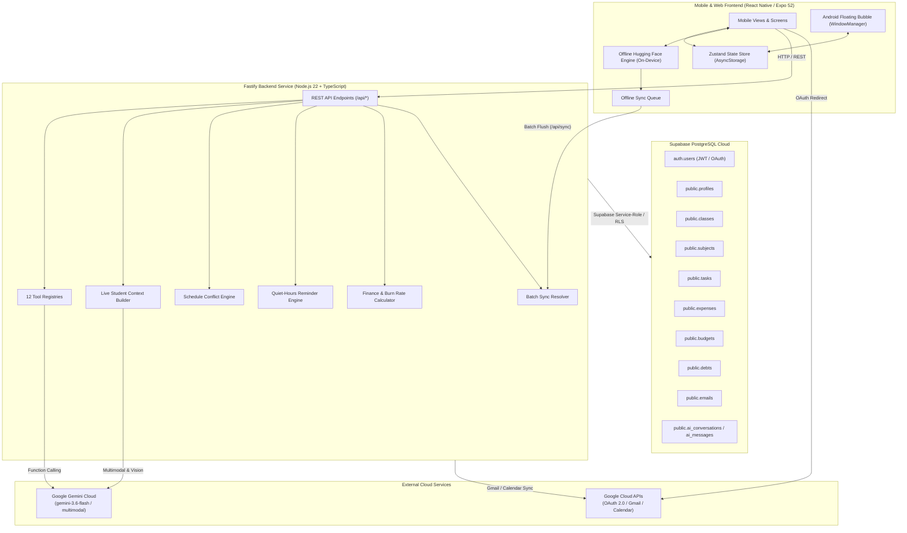
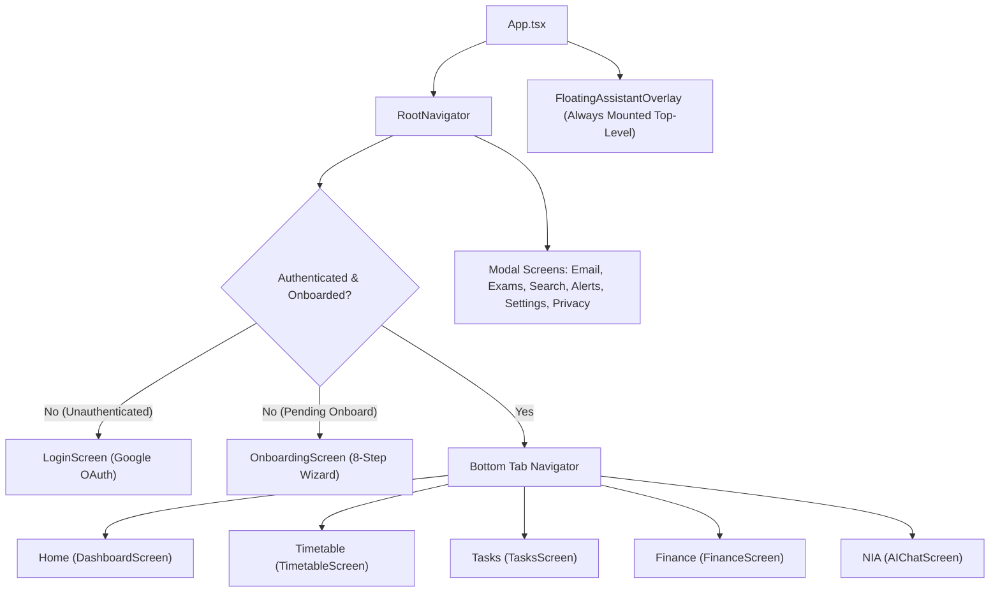
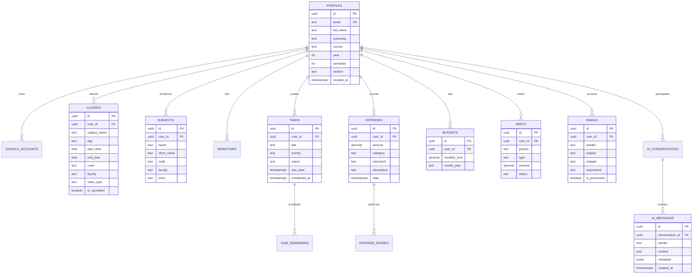
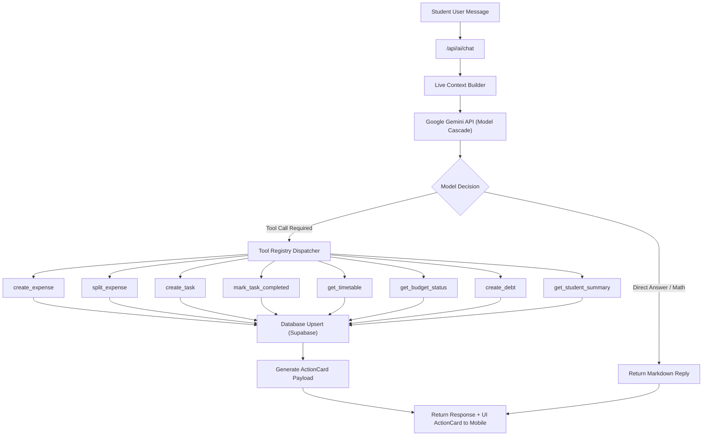
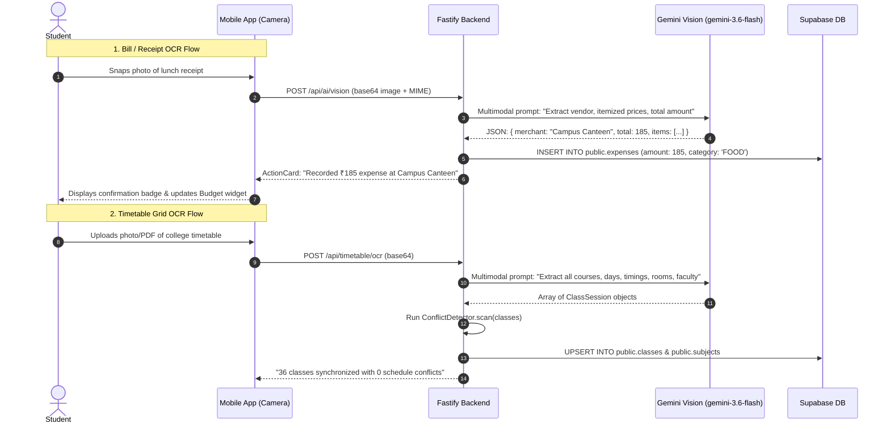
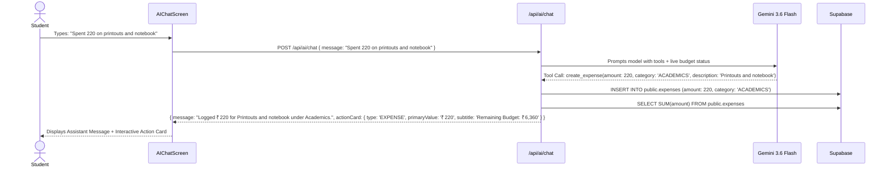
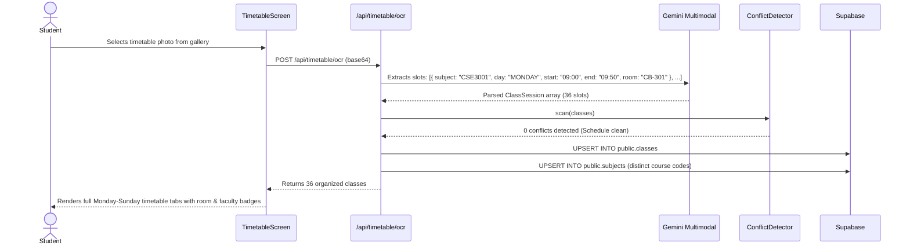
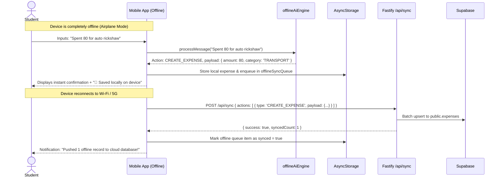

# 🏛️ NEXA & NIA — System Architecture & AI Integration Guide

Welcome to the comprehensive technical architecture guide for **NEXA** and its built-in intelligent companion, **NIA** (**Nexa Intelligent Assistance**). 

This document explains the entire system end-to-end: the high-level topology, component interactions, database schema, and deep-dive execution flows of the **Hybrid Dual AI Engine**.

---

## 📑 Table of Contents

1. [Executive Overview](#1-executive-overview)
2. [High-Level System Topology](#2-high-level-system-topology)
3. [Monorepo Package Structure](#3-monorepo-package-structure)
4. [Mobile Frontend Architecture](#4-mobile-frontend-architecture)
   - [Zustand State Architecture](#zustand-state-architecture)
   - [Android Floating Assistant Overlay](#android-floating-assistant-overlay)
5. [Backend Architecture](#5-backend-architecture)
   - [Fastify REST Server](#fastify-rest-server)
   - [Deterministic Algorithmic Engines](#deterministic-algorithmic-engines)
   - [Dual Persistence Layer](#dual-persistence-layer)
6. [Database Schema & Data Model](#6-database-schema--data-model)
   - [Entity Relationship Diagram](#entity-relationship-diagram)
   - [Tenant Security & RLS](#tenant-security--rls)
7. [AI Integration Architecture (NIA)](#7-ai-integration-architecture-nia)
   - [Hybrid Dual-Engine Topology](#hybrid-dual-engine-topology)
   - [Engine 1: Cloud Gemini & 12 Autonomous Tools](#engine-1-cloud-gemini--12-autonomous-tools)
   - [Live Student Context Builder](#live-student-context-builder)
   - [Engine 2: On-Device Hugging Face AI](#engine-2-on-device-hugging-face-ai)
   - [Multimodal OCR Pipeline](#multimodal-ocr-pipeline)
   - [Email Notice Summarization Pipeline](#email-notice-summarization-pipeline)
8. [End-to-End Sequence Lifecycles](#8-end-to-end-sequence-lifecycles)
   - [Lifecycle A: Natural Language Expense Logging](#lifecycle-a-natural-language-expense-logging)
   - [Lifecycle B: Timetable Photo Extraction & Conflict Detection](#lifecycle-b-timetable-photo-extraction--conflict-detection)
   - [Lifecycle C: Offline Execution & Cloud Batch Sync](#lifecycle-c-offline-execution--cloud-batch-sync)
9. [Deployment & Infrastructure](#9-deployment--infrastructure)

---

## 1. Executive Overview

**NEXA** is a full-stack, mobile-first academic and campus life companion. It consolidates a university student's chaotic daily lifecycle—Google services (Gmail notices, academic calendar), daily class timetables, exam conflicts, assignments, monthly budgets, debts, and expense splits—into a single calm, high-performance interface.

At the core is **NIA** (**Nexa Intelligent Assistance**), an AI companion capable of both cloud-scale multimodal reasoning (powered by Google Gemini) and zero-latency, private, on-device offline reasoning (powered by Hugging Face SLMs).

```
 ┌─────────────────────────────────────────────────────────────────────────────┐
 │                               NEXA ECOSYSTEM                                │
 │                                                                             │
 │  ┌─────────────────┐       ┌──────────────────┐      ┌──────────────────┐   │
 │  │ Academic Life   │       │ Campus Finance   │      │ Daily Operations │   │
 │  │ • Timetable     │       │ • Daily Expenses │      │ • Tasks & Remind │   │
 │  │ • Conflict Scan │  ◄──► │ • Safe Burn Rate │ ◄──► │ • Gmail Circulars│   │
 │  │ • Exam Hall     │       │ • Split Debts    │      │ • Floating Gem   │   │
 │  └─────────────────┘       └──────────────────┘      └──────────────────┘   │
 │                                     ▲                                       │
 │                                     │                                       │
 │                     ┌───────────────┴───────────────┐                       │
 │                     │    NIA INTELLIGENT COMPANION  │                       │
 │                     │  (Cloud Gemini + On-Device HF)│                       │
 │                     └───────────────────────────────┘                       │
 └─────────────────────────────────────────────────────────────────────────────┘
```

---

## 2. High-Level System Topology



---

## 3. Monorepo Package Structure

The repository uses standard **npm workspaces** with three core layers:

```
GLITCHERS/
├── package.json               # Root monorepo workspace configuration
├── README.md                  # Project overview & quickstart
├── ARCHITECTURE.md            # This technical architecture guide
├── render.yaml                # Render cloud deployment blueprint
│
├── shared/                    # Shared types & validation schemas
│   ├── package.json           # @glitchers/shared
│   ├── src/
│   │   ├── types/             # TypeScript contracts (ClassSession, Task, Expense, etc.)
│   │   ├── schemas/           # Runtime Zod validation schemas
│   │   └── index.ts           # Barrel export
│
├── backend/                   # Fastify Node.js server
│   ├── package.json           # @glitchers/backend
│   ├── src/
│   │   ├── server.ts          # Server entry point & listener
│   │   ├── app.ts             # Fastify plugin registrations, CORS, error handlers
│   │   ├── config/            # EnvSchema (Zod validated environment)
│   │   ├── routes/            # Modular route controllers (/auth, /timetable, /ai, etc.)
│   │   ├── services/
│   │   │   ├── gemini/        # Gemini client, tool registry, live context builder
│   │   │   ├── timetable/     # Slot extraction & conflict detector algorithms
│   │   │   ├── tasks/         # Smart reminder schedules & quiet hours calculator
│   │   │   ├── finance/       # Budget math, safe daily burn rate, expense splitting
│   │   │   ├── email/         # University circular parser & notice classifier
│   │   │   └── sync/          # Batch sync resolution for offline queues
│   │   └── repositories/      # SupabaseClient, SupabaseStore, InMemoryStore
│   └── tests/                 # Automated Jest test suites (API, math, conflict, reminders)
│
├── mobile/                    # React Native (Expo SDK 52) application
│   ├── package.json           # @glitchers/mobile
│   ├── app.json               # Expo configuration (NEXA name, nexa:// scheme)
│   ├── eas.json               # EAS Cloud build profiles (preview APK, production AAB)
│   ├── android/               # Native Kotlin Floating Assistant overlay bridge
│   └── src/
│       ├── navigation/        # Bottom tab navigator (Home, Timetable, Tasks, NIA, etc.)
│       ├── screens/           # 12 primary app screens (Dashboard, AIChat, Finance, etc.)
│       ├── components/        # Reusable design tokens, GlassCard, FloatingAssistant
│       ├── store/             # Zustand stores (dashboardStore, authStore, floatingStore)
│       ├── services/          # offlineAiEngine (100% on-device Hugging Face manager)
│       └── api/               # Typed apiClient HTTP client with token fallbacks
│
└── database/                  # Database definitions & migrations
    ├── schema.sql             # Reproducible PostgreSQL DDL for Supabase
    └── migrations/            # Versioned SQL migrations with RLS policies
```

---

## 4. Mobile Frontend Architecture

The frontend is built using **Expo SDK 52** and compiles simultaneously to **Android APK**, **iOS**, and **Web** (`react-native-web`).

### Navigation Hierarchy



### Zustand State Architecture

State is managed via three dedicated stores:

1. **`authStore`**:
   - Manages Google OAuth tokens, user profile, and onboarding step progression.
   - Persisted to AsyncStorage under key `nexa-auth-storage` (with automatic fallback to legacy `glitchers-auth-storage`).
2. **`dashboardStore`**:
   - Central reactive store for `classes`, `tasks`, `expenses`, `budget`, `debts`, `emails`, and `chatMessages`.
   - Houses the **Offline Sync Queue** (`offlineSyncQueue`). When offline, user actions are stored with UUIDs and timestamped payloads.
   - Houses the **Hugging Face Model Manager** (`activeOfflineModel`, `downloadedModels`, `downloadProgress`).
3. **`floatingStore`**:
   - Manages UI state for the floating gem widget: visibility toggle, menu expansion state, and active mini-window (`NONE | EMAIL | FINANCE | TASKS | CALENDAR | AI`).

### Android Floating Assistant Overlay

The floating bubble operates in two modes:

1. **In-App Translucent Dock**: Implemented in React Native via `FloatingAssistantOverlay.tsx` (`zIndex: 9999`). Allows quick micro-actions (quick expense logging, upcoming class countdown, or one-line question to NIA) without navigating away from the current screen.
2. **System-Wide Android Native Overlay**: Implemented in Kotlin via `FloatingBubbleService.kt` and `FloatingOverlayModule.kt` using Android's `WindowManager.LayoutParams.TYPE_APPLICATION_OVERLAY`. Draws a draggable bubble over any third-party app on Android (e.g. Chrome, WhatsApp, Canvas) with permission `SYSTEM_ALERT_WINDOW`.

---

## 5. Backend Architecture

### Fastify REST Server

The backend runs on **Fastify 5.x** with ESM modules and strict TypeScript. Fastify was selected for its near-zero overhead (2x–4x faster than Express) and native JSON schema serialization.

#### Modular Route Layout:
- `/api/auth`: Google OAuth 2.0 authorization URL generator and code callback exchange.
- `/api/timetable`: Class session CRUD, slot conflict scanning, and OCR image parser.
- `/api/tasks`: Priority task management, completion toggling, and reminder generation.
- `/api/expenses`: Expense logging, categorical grouping, and receipt bill OCR parser.
- `/api/budgets`: Monthly budget limits, spending totals, and threshold triggers.
- `/api/debts`: Borrow & lend records, settlement marks, and equal split math.
- `/api/emails`: University notice parser, critical circular alerts, and Gemini briefing summarizer.
- `/api/ai`: Universal chat endpoint, multimodal vision endpoint, and conversation history.
- `/api/sync`: Batch sync endpoint that receives an array of offline actions and reconciles them into the database atomically.
- `/health`: Diagnostic telemetry returning status, active DB provider (Supabase vs In-Memory), memory heap usage, and uptime.

### Deterministic Algorithmic Engines

NEXA never relies on AI for deterministic calculations where accuracy is critical. Dedicated mathematical and algorithmic engines handle these tasks:

1. **Conflict Detection Engine (`conflictDetector.ts`)**:
   - Converts `startTime` and `endTime` into absolute minutes from midnight.
   - Detects overlapping time windows across Monday through Sunday:
     $$\text{Conflict} \iff (\text{start}_A < \text{end}_B) \land (\text{start}_B < \text{end}_A) \land (\text{day}_A = \text{day}_B)$$
2. **Reminder & Quiet Hours Engine (`reminderEngine.ts`)**:
   - Calculates notification trigger times: 24h before, 2h before, and 30m before deadlines.
   - **Quiet Hours Suppression**: If a notification falls between 11:00 PM and 7:00 AM, non-critical reminders are automatically shifted to 7:30 AM the next morning.
3. **Finance & Burn Rate Engine (`calculator.ts`)**:
   - Computes safe daily allowance:
     $$\text{Safe Daily Burn} = \frac{\text{Budget Monthly Limit} - \text{Total Spent this Month}}{\text{Days Remaining in Month}}$$
   - Generates exact ₹ debt distributions when splitting bills among multiple peers.

### Dual Persistence Layer

The backend uses an abstraction pattern (`SupabaseStore` and `InMemoryStore`):
- **Production**: Connects to Supabase PostgreSQL using service-role authentication.
- **Resilience Fallback**: If Supabase credentials are not configured or network connectivity drops, the backend automatically falls back to `InMemoryStore` without crashing, ensuring dev servers and integration tests always pass.

---

## 6. Database Schema & Data Model

The schema is defined in [schema.sql](file:///c:/Users/Admin/OneDrive/Desktop/GLICHERS/database/schema.sql) and enforces strict relational integrity.

### Entity Relationship Diagram



### Tenant Security & RLS

Every data table in Supabase enables **Row Level Security (RLS)**:
```sql
ALTER TABLE public.classes ENABLE ROW LEVEL SECURITY;
CREATE POLICY "Tenant isolation for classes" 
ON public.classes FOR ALL 
USING (auth.uid() = user_id);
```
Clients communicating directly with Supabase can only read and write rows matching their authenticated `auth.uid()`. Server-side operations run via Fastify using the Supabase Service Role Key.

---

## 7. AI Integration Architecture (NIA)

### Hybrid Dual-Engine Topology

NIA features a **hybrid execution architecture**:

| Capability | Cloud Gemini Engine | On-Device Hugging Face Engine |
| :--- | :--- | :--- |
| **Model** | `gemini-3.6-flash` / `gemini-flash-lite-latest` | GGUF Quantized SLMs (Qwen2.5 / SmolLM) |
| **Execution** | Google Cloud API | 100% On-Device (Zero Server Latency) |
| **Latency** | 600ms – 1200ms | 20ms – 80ms |
| **Network Required** | Yes (Internet Required) | **No (Works 100% Offline)** |
| **Primary Strength** | ChatGPT-grade reasoning, Multimodal OCR, Web Search | Instant action logging, local timetable lookup, math solving |
| **Privacy Level** | Cloud Encrypted (OAuth / API Key) | **Zero Data leaves device** |

---

### Engine 1: Cloud Gemini & 12 Autonomous Tools

When connected, NIA utilizes Google Gemini with **Function Calling** enabled. NIA is registered with 12 structured tools defined in [toolRegistry.ts](file:///c:/Users/Admin/OneDrive/Desktop/GLICHERS/backend/src/services/gemini/toolRegistry.ts):



#### The 12 Registered Tools:
1. `create_expense`: Logs spending with category classification (FOOD, ACADEMICS, TRANSPORT, etc.).
2. `get_expenses`: Queries spending history for today, yesterday, or custom dates.
3. `create_task`: Adds assignments or todos with calculated priority and deadline.
4. `get_tasks`: Queries pending workload.
5. `get_timetable`: Retrieves lectures and lab slots for today, tomorrow, or a specific day.
6. `split_expense`: Splits a restaurant or project bill equally and creates debt tracking records.
7. `get_budget_status`: Returns current consumption and safe daily allowance.
8. `create_debt`: Logs money owed or money borrowed.
9. `get_debts`: Summarizes who owes the student and who the student owes.
10. `get_emails`: Queries extracted notices from the university.
11. `mark_task_completed`: Toggles task status to COMPLETED.
12. `get_student_summary`: Synthesizes full academic and financial status into an executive overview.

---

### Live Student Context Builder

To prevent hallucinations and provide lightning-fast context, the backend injects the student's live database state directly into Gemini's system prompt on every turn ([geminiClient.ts](file:///c:/Users/Admin/OneDrive/Desktop/GLICHERS/backend/src/services/gemini/geminiClient.ts)):

```
STUDENT LIVE APP DATABASE:
[CLASSES / TIMETABLE]:
• STS2010 on TUESDAY at 08:00 - 08:50 in room AB1-204 (Faculty: Faculty Member)
• ECE2002 on TUESDAY at 09:00 - 09:50 in room AB1-204 (Faculty: Faculty Member)

[EXPENSE TRACKER & RECENT SPENDING]:
• ₹180 on Lunch at Food Mall (FOOD) [TODAY]
• ₹450 on Data Structures Book (ACADEMICS) [YESTERDAY]

[MONTHLY BUDGET]:
• Monthly Limit: ₹10,000 | Spent: ₹3,420 | Remaining: ₹6,580 | Safe Daily Burn: ₹286/day

[TASK MANAGER & PENDING ASSIGNMENTS]:
• [HIGH] Operating Systems Lab 4 (Due: 10/09/2026)
```

Because Gemini has access to the student's exact live database in the prompt, queries like *"How much did I spend yesterday?"* or *"What is my next class?"* resolve with zero hallucination and mathematically exact figures.

---

### Engine 2: On-Device Hugging Face AI

When offline or in airplane mode, the mobile app routes queries to `offlineAiEngine.ts`:

1. **Local Intent Parser**: Uses deterministic regex patterns to detect expenses (*"Spent 150 on coffee"*), tasks (*"Remind me to submit project tomorrow"*), splits (*"Split 600 for pizza with Rohit"*), and timetable lookups (*"What classes today?"*).
2. **On-Device Educational Knowledge Base**: Includes built-in offline retrieval for:
   - Data structures (Stacks, Queues, Binary Trees, Graphs)
   - Algorithms (Binary Search, MergeSort, BFS, DFS)
   - Mathematical equations (Linear solvers, calculus fundamentals)
   - Programming cheat-sheets (Python, C++, JS, SQL)
3. **Offline Sync Queue**: Any action created offline is stored locally in SQLite / AsyncStorage with `synced: false`. When network connectivity resumes, the app flushes the queue to `/api/sync` in a single atomic batch.

---

### Multimodal OCR Pipeline

Students frequently receive paper receipts, cafeteria bills, and printed timetable sheets. NIA has two multimodal pipelines:



---

### Email Notice Summarization Pipeline

University circulars are typically long, bureaucratic, and packed with irrelevant administrative text. NEXA's email engine:

1. **Filters University Domain**: Only analyzes emails from official university domains (e.g. `@vitap.ac.in`, `@srmist.edu.in`).
2. **Classifier**: Scans for keywords like *"Continuous Assessment"*, *"Semester Examination"*, *"Holiday"*, *"Class Rescheduled"*, or *"Fee Deadline"*.
3. **Gemini Briefing Engine**: Condenses 50+ emails into a crisp, 3-bullet executive morning briefing displayed on the Home Dashboard ([DashboardScreen.tsx](file:///c:/Users/Admin/OneDrive/Desktop/GLICHERS/mobile/src/screens/DashboardScreen.tsx)).

---

## 8. End-to-End Sequence Lifecycles

### Lifecycle A: Natural Language Expense Logging



---

### Lifecycle B: Timetable Photo Extraction & Conflict Detection



---

### Lifecycle C: Offline Execution & Cloud Batch Sync



---

## 9. Deployment & Infrastructure

### Production Topology

```
                  ┌─────────────────────────────────────┐
                  │          EXPO EAS CLOUD             │
                  │   • Android Build: .apk / .aab      │
                  │   • Project: @kunal4060s-team/kunal │
                  └──────────────────┬──────────────────┘
                                     │
                     Direct APK / Play Store Install
                                     │
                                     ▼
                  ┌─────────────────────────────────────┐
                  │       STUDENT MOBILE DEVICE         │
                  │        • NEXA (React Native)        │
                  │        • NIA On-Device Engine       │
                  └──────────────────┬──────────────────┘
                                     │ HTTPS
                                     ▼
                  ┌─────────────────────────────────────┐
                  │          RENDER.COM CLOUD           │
                  │   • Web Service: glitchers-backend  │
                  │   • Docker Runtime (Node.js 22)     │
                  │   • Fastify Server on Port 5000     │
                  └──────────┬──────────────────────┬───┘
                             │                      │
             Google Cloud APIs (OAuth)              │ Supabase Client (RLS)
                             ▼                      ▼
                  ┌─────────────────────┐┌──────────────────────┐
                  │    GOOGLE CLOUD     ││     SUPABASE CLOUD   │
                  │ • Gemini 3.6 Flash  ││ • PostgreSQL 16      │
                  │ • Gmail API         ││ • Row-Level Security │
                  │ • Calendar API      ││ • Database Triggers  │
                  └─────────────────────┘└──────────────────────┘
```

### Key Environment Variables

| Variable | Scope | Purpose |
| :--- | :--- | :--- |
| `EXPO_PUBLIC_API_URL` | Mobile / Client | Backend base URL (`https://glitchers-backend.onrender.com/api` or `http://localhost:5000/api`) |
| `PORT` | Backend | Fastify listening port (default: `5000`) |
| `SUPABASE_URL` | Backend | Supabase project instance endpoint |
| `SUPABASE_SERVICE_ROLE_KEY` | Backend | Admin database access key (strictly server-side, never on client) |
| `GEMINI_API_KEY` | Backend | Google Generative AI API Key for NIA reasoning & OCR |
| `GOOGLE_CLIENT_ID` | Backend / Mobile | Google OAuth 2.0 Client ID for student sign-in |
| `GOOGLE_CLIENT_SECRET` | Backend | Google OAuth 2.0 Secret for server token exchange |
| `JWT_SECRET` | Backend | Fastify session signature key |

---

## 10. Summary

NEXA and NIA represent a clean, enterprise-grade architecture:
- **Resilient**: Works smoothly offline and on unstable university campus networks via local caching and queue syncing.
- **Fast**: Combines Fastify's rapid execution with on-device instant responses and Gemini Flash for complex multimodal tasks.
- **Accurate**: Deterministic finance math and schedule conflict detection are never left to generative hallucination.
- **Secure**: Every student's academic and financial data is strictly partitioned using Supabase Row-Level Security.
